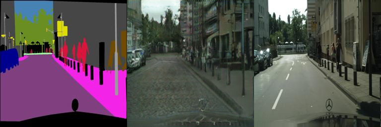
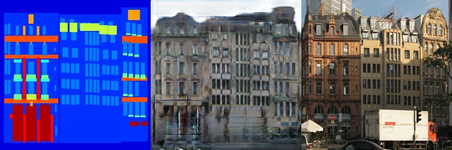

# Mindspore-Pix2pix
[Mindspore](https://www.mindspore.cn/) is a deep learning framework develop by [Huawei](https://www.huawei.com/cn/?ic_medium=direct&ic_source=surlent). This is an Implementation of [Pix2pix](https://arxiv.org/pdf/1703.10593.pdf). More implementation will be released soon on my [site](https://github.com/yyyzzzhao).
Tutorials about this deep learning framework is on [Mindspore](https://www.mindspore.cn/doc/programming_guide/zh-CN/master/index.html)

## This is the results of our implementation 
- Our label-to-streetview results

  
  

- label-to-facades results

  
  

## Some metrics on Cityscapes dataset
- FCN scores in our model

|Parameter|Mean pixel accuracy|Mean class accuracy|Mean class IoU|
|:-|:-:|:-:|:-:|
|G8-D3|**0.57**|**0.23**|**0.14**|
|G7-D4|**0.57**|0.22|0.14|
|G8-D4|0.54|0.21|0.13|

- Metrics in [paper](https://arxiv.org/pdf/1703.10593.pdf)

|Parameter|Mean pixel accuracy|Mean class accuracy|Mean class IoU|
|:-|:-:|:-:|:-:|
|G8-D3|**0.66**|**0.23**|**0.17**|
|GT|0.80|0.23|0.17|

## The code and corresponding models will be pulbic soon

## Dataset
- We use the Cityscapes dataset. To train a model on the full dataset, please download it from the [official website](https://www.cityscapes-dataset.com/) (registration required).

## Acknowledgments
Our implementation borrows heavily from [pytorch-CycleGAN-and-pix2pix](https://github.com/junyanz/pytorch-CycleGAN-and-pix2pix).